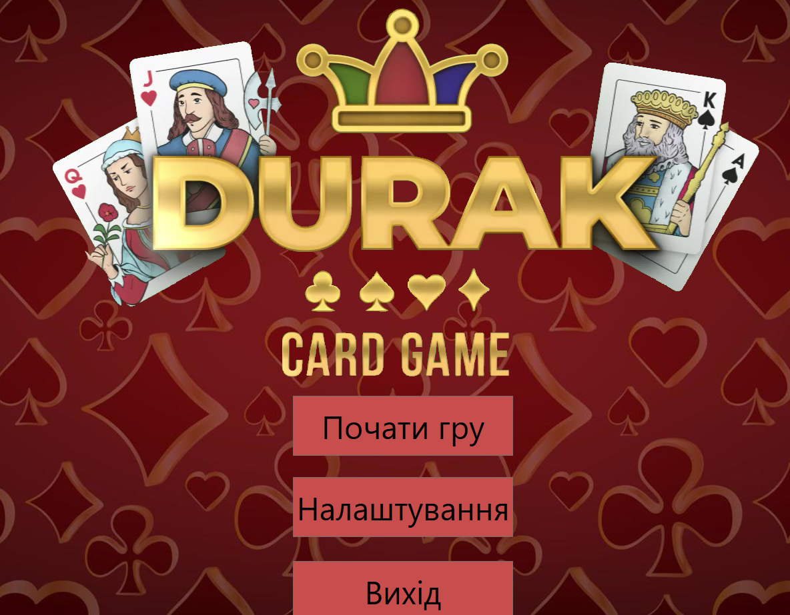
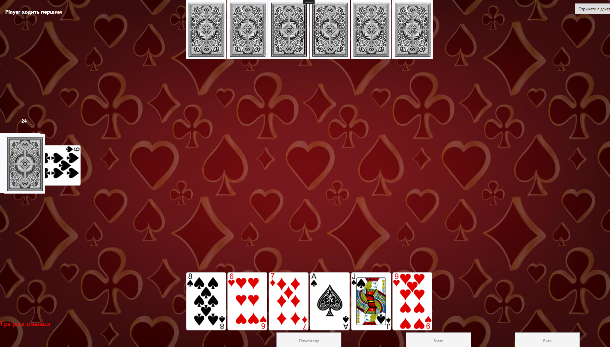
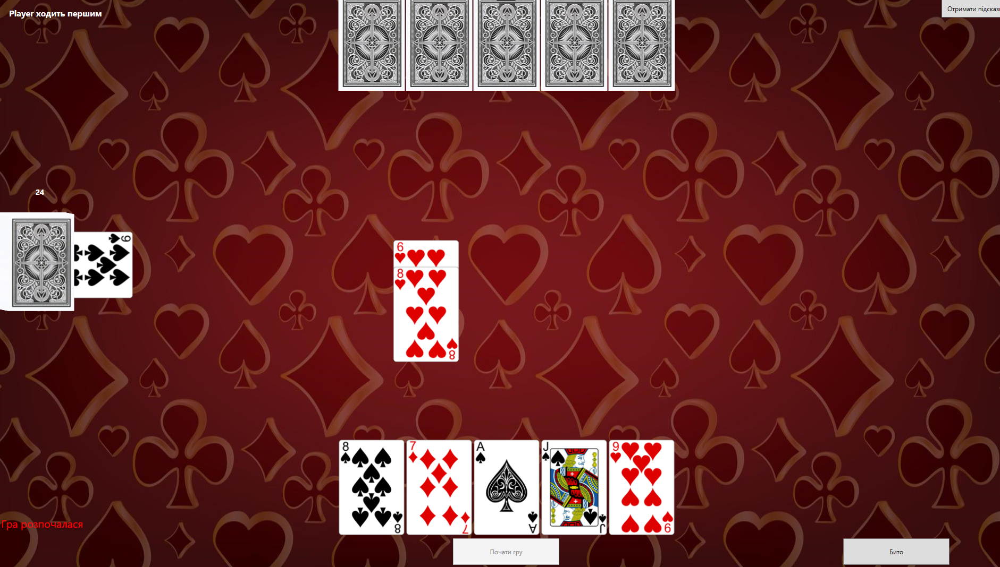
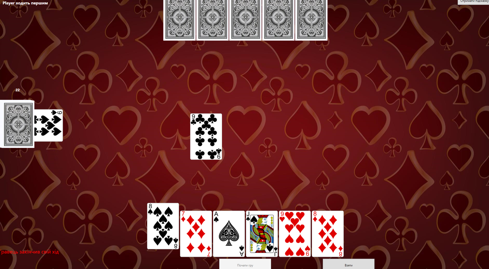
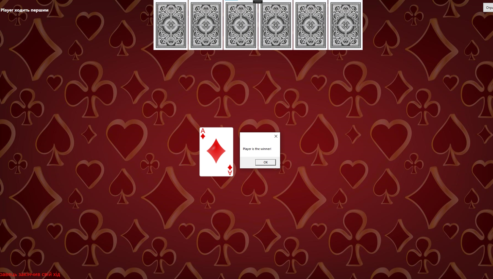

## Table of Contents

- [Screenshots](#screenshots)
- [Installation](#installation)
- [Usage](#usage)
- [Programming Principles](#programming-principles)
- [Design Patterns](#design-patterns)
  - [Strategy Pattern](#strategy-pattern)
  - [Memento Pattern](#memento-pattern)
  - [Chain of Responsibility Pattern](#chain-of-responsibility-pattern)
  - [Observer Pattern](#observer-pattern)
- [Refactoring Techniques](#refactoring-techniques)
## Screenshots
#### **1. Основний екран**


#### **2. Гра почалась**


#### **3. Хід гравця**


#### **4. Хід бота**


#### **5. Перемога**

## Installation

To run the Durak game locally, follow these steps:

1. Clone the repository:
    ```sh
    https://github.com/ruslan-kuksa/DurakGame
    ```
2. Open Visual Studio
3. Open the solution DurakGame.sln:
4. Run the project, click F5 or green button on panel in VS:

## Usage

After starting the application, you can start a new game by clicking the "Start Game" button. The game will initialize with one human player and one bot player. The game determines which player (human or bot) plays cards first. You can play cards by clicking on them, and the bot will defend or take cards automatically. The bot selects low-rank cards and non-trump cards for its turn to attack the player. The player can either defend from the bot's cards or take the cards from the table.

## Programming Principles

The following programming principles were adhered to during the development of this project:

- **DRY (Don't Repeat Yourself)**: This principle was followed by extracting common code into reusable methods and classes.

- **KISS (Keep It Simple, Stupid)**: The design and implementation of the game were kept as simple as possible, avoiding unnecessary complexity.

- **SOLID**:
  - **Single Responsibility Principle (SRP)**: Each class in the project has a single responsibility. For example, [`Deck.cs`](DurakGame/Models/Deck.cs) represents the deck of the game.
  - **Open/Closed Principle (OCP)**: The game is designed to be easily extendable. For example, new strategies for bots can be added without modifying existing code.
  - **Liskov Substitution Principle (LSP)**: Objects of a superclass should be replaceable with objects of a subclass without affecting the functionality. For example, [`HumanPlayer.cs`](DurakGame/Models/HumanPlayer.cs) and [`BotPlayer.cs`](DurakGame/Models/BotPlayer.cs) can be used interchangeably as [`Player.cs`](DurakGame/Models/Player.cs), and [`HintHandler.cs`](DurakGame/Hints/HintHandler.cs) can be extended without altering existing functionality.
  - **Interface Segregation Principle (ISP)**: Interfaces are designed to be client-specific rather than general-purpose. For example, [`IHintHandler.cs`](DurakGame/Hints/IHintHandler.cs), [`IBotStrategy.cs`](DurakGame/Strategy/IBotStrategy.cs) and [`IHumanStrategy`](DurakGame/Strategy/IHumanStrategy.cs) are specific to their respective functionalities.
  - **Dependency Inversion Principle (DIP)**: High-level modules depend on abstractions rather than concrete classes. This is seen in the use of interfaces like [`IHintHandler.cs`](DurakGame/Hints/IHintHandler.cs), [`IBotStrategy.cs`](DurakGame/Strategy/IBotStrategy.cs) and [`IHumanStrategy`](DurakGame/Strategy/IHumanStrategy.cs).

- **YAGNI (You Aren't Gonna Need It)**: Features were not added unless they were necessary. For example, only essential game features were implemented initially, and additional features were considered based on necessity.

- **Composition Over Inheritance**: Composition was preferred over inheritance to achieve code reuse. For example, the [`BotPlayer.cs`](DurakGame/Models/BotPlayer.cs) class uses composition to include strategies for playing cards.

- **Program to Interfaces, not Implementations**: The game logic relies on interfaces rather than concrete implementations. For example, using [`IHintHandler`](DurakGame/Hints/IHintHandler.cs) and [`IBotStrategy`](DurakGame/Strategy/IBotStrategy.cs) interfaces.

- **Fail Fast**: The game logic is designed to fail early if there are errors. Validaction place in [`Validation`](DurakGame/Validation) folder.
## Design Patterns

### Strategy Pattern

The Strategy Pattern is used to define different algorithms for attacking and defending. This allows for flexibility and extensibility in how players (both human and bot) play their turns.

#### Code Example
- [`IHumanStrategy.cs`](DurakGame/Strategy/IHumanStrategy.cs)
  ```csharp
    public interface IHumanStrategy
    {
        bool PlayCardStrategy(Player player, Card card, Table table, Card trumpCard, out string errorMessage);
    }
  ```
  
- [`HumanDefenseStrategy.cs`](DurakGame/Strategy/HumanDefenseStrategy.cs)
  ```csharp
    public class HumanDefenseStrategy : IHumanStrategy
    {
        private readonly BaseValidator _validator;

        public HumanDefenseStrategy(BaseValidator validator)
        {
            _validator = validator;
        }

        public bool PlayCardStrategy(Player player, Card card, Table table, Card trumpCard, out string errorMessage)
        {
            try
            {
                _validator.SetValidationStrategy(new DefenseCardValidation());
                _validator.Validate(player, card, table, trumpCard);
                player.RemoveCardFromHand(card);
                table.AddDefenseCard(card);
                errorMessage = string.Empty;
                return true;
            }
            catch (GameValidationException ex)
            {
                errorMessage = ex.Message;
                return false;
            }
        }
    }
  ```
- [`HumanAttackStrategy.cs`](DurakGame/Strategy/HumanAttackStrategy.cs)
  ```csharp
    public class HumanAttackStrategy : IHumanStrategy
    {
        private readonly BaseValidator _validator;

        public HumanAttackStrategy(BaseValidator validator)
        {
            _validator = validator;
        }

        public bool PlayCardStrategy(Player player, Card card, Table table, Card trumpCard, out string errorMessage)
        {
            try
            {
                _validator.SetValidationStrategy(new AttackCardValidation());
                _validator.Validate(player, card, table, trumpCard);
                player.RemoveCardFromHand(card);
                table.AddAttackCard(card);
                errorMessage = string.Empty;
                return true;
            }
            catch (GameValidationException ex)
            {
                errorMessage = ex.Message;
                return false;
            }
        }
    }
  ```

### Memento Pattern

The Memento Pattern implements undo functionality, allowing the game to be restored to a previous state.

#### Code

- [`GameCaretaker.cs`](DurakGame/Memento/GameCaretaker.cs)
  ```csharp
    public class GameCaretaker
    {
        private Stack<GameMemento> _mementos = new Stack<GameMemento>();

        public void Save(GameMemento memento)
        {
            _mementos.Push(memento);
        }

        public GameMemento Undo()
        {
            if (_mementos.Count > 0)
            {
                return _mementos.Pop();
            }
            return null;
        }
    }
  ```
- [`GameMemento.cs`](DurakGame/Memento/GameMemento.cs)
  ```csharp
    public class GameMemento
    {
        public List<Card> PlayerHand { get; private set; }
        public List<Card> TableAttackCards { get; private set; }
        public List<Card> TableDefenseCards { get; private set; }
        public Player ActivePlayer { get; private set; }

        public GameMemento(List<Card> playerHand, List<Card> tableAttackCards, List<Card> tableDefenseCards, Player activePlayer)
        {
            PlayerHand = new List<Card>(playerHand);
            TableAttackCards = new List<Card>(tableAttackCards);
            TableDefenseCards = new List<Card>(tableDefenseCards);
            ActivePlayer = activePlayer;
        }
    }
  ```
- [`SaveState`](DurakGame/Models/GameManager.cs#L174)
  ```csharp
        public GameMemento SaveState()
        {
            return new GameMemento(
                new List<Card>(Players[0].Hand),
                new List<Card>(Table.AttackCards),
                new List<Card>(Table.DefenseCards),
                ActivePlayer
            );
        }
  ```
- [`RestoreState`](DurakGame/Models/GameManager.cs#L184)
  ```csharp
        public void RestoreState(GameMemento memento)
        {
            Players[0].SetHand(new List<Card>(memento.PlayerHand));
            Table.SetAttackCards(new List<Card>(memento.TableAttackCards));
            Table.SetDefenseCards(new List<Card>(memento.TableDefenseCards));
            ActivePlayer = memento.ActivePlayer;
            OnGameChanged();
        }
  ```
### Observer Pattern

The Observer Pattern notifies the UI of changes in the game state. 
When the game state changes, all subscribed observers are notified and can update accordingly.

#### Code

- [`GameManager.cs`](DurakGame/Models/GameManager.cs)
  ```csharp
    public class GameManager
    {
        public event Action GameChanged;

        public void OnGameChanged() => GameChanged?.Invoke();
    }
  ```
- [`MainGamePage.cs`](DurakGame/Views/MainGamePage.cs)
  ```csharp
    public partial class MainGamePage : Page
    {
        public void InitializeGameManager()
        {
            Game = new GameManager();
            Game.GameChanged += OnGameStateChanged;
        }
        private void OnGameStateChanged()
        {
            UIManager.UpdateUI();
        }
    }
  ```

### Chain of Responsibility Pattern

The Chain of Responsibility Pattern handles hints, where multiple handlers process a request.

#### Code

- [`IHintHandler.cs`](DurakGame/Hints/IHintHandler.cs)
  ```csharp
    public interface IHintHandler
    {
        IHintHandler SetNext(IHintHandler handler);

        string Handle(Player player, Table table, Card trumpCard);
    }
  ```
- [`HintHandler.cs`](DurakGame/Hints/HintHandler.cs)
  ```csharp
    public abstract class HintHandler : IHintHandler
    {
        private IHintHandler? _nextHandler;

        public IHintHandler SetNext(IHintHandler handler)
        {
            _nextHandler = handler;
            return handler;
        }

        public virtual string Handle(Player player, Table table, Card trumpCard)
        {
            if (_nextHandler != null)
            {
                return _nextHandler.Handle(player, table, trumpCard);
            }
            else
            {
                return GameNotification.NoAvailableHintsMessage;
            }
        }
    }
  ```
- [`AttackHintHandler.cs`](DurakGame/Hints/AttackHintHandler.cs)
  ```csharp
    public class AttackHintHandler : HintHandler
    {
        public override string Handle(Player player, Table table, Card trumpCard)
        {
            if (table.AttackCards.Count <= table.DefenseCards.Count)
            {
                List<Card> availableCards = player.Hand
                    .Where(table.CanAddAttackCard)
                    .OrderBy(card => card.Rank)
                    .ToList();

                if (availableCards.Any())
                {
                    Card bestCard = availableCards.First();
                    return string.Format(GameNotification.RecommendAttackMessage, bestCard.Rank, bestCard.Suit);
                }
            }

            return base.Handle(player, table, trumpCard);
        }
    }
  ```
- [`DefenseHintHandler.cs`](DurakGame/Hints/DefenseHintHandler.cs)
  ```csharp
    public class DefenseHintHandler : HintHandler
    {
        public override string Handle(Player player, Table table, Card trumpCard)
        {
            if (table.AttackCards.Count > table.DefenseCards.Count)
            {
                Card cardToBeat = table.AttackCards.LastOrDefault();
                if (cardToBeat == null)
                    return GameNotification.NoDefenseCardsMessage;

                List<Card> availableCards = player.Hand
                    .Where(card => card.CanBeat(cardToBeat, trumpCard.Suit))
                    .OrderBy(card => card.Rank)
                    .ToList();

                if (availableCards.Any())
                {
                    Card bestCard = availableCards.First();
                    return string.Format(GameNotification.RecommendDefenseMessage, bestCard.Rank, bestCard.Suit);
                }
            }

            return base.Handle(player, table, trumpCard);
        }
    }
  ```

## Refactoring Techniques

Refactoring techniques employed:

- **Extract Method**: Complex methods were broken down into smaller, more manageable methods. For example, the [`StartGame`](DurakGame/Models/GameManager.cs#L53) method in [`GameManager.cs`](DurakGame/Models/GameManager.cs) was split into [`DealInitialCards`](DurakGame/Models/GameManager.cs#L61) and [`SetTrumpCard`](DurakGame/Models/GameManager.cs#L72).
- **Replace Magic Number with Symbolic Constant**: Magic numbers were replaced with constants defined in [`GameConstants.cs`](DurakGame/GameConstants/GameConstants.cs).
- **Introduce Parameter Object**: Grouped related parameters into objects. For instance, in [`GameMemento.cs`](DurakGame/Memento/GameMemento.cs), parameters related to the game state were grouped.
- **Replace Nested Conditional with Guard Clauses**: Special checks and edge cases were isolated into separate clauses. For example, [`UIBotManager.cs`](DurakGame/ViewHandler/UIBotManager.cs).
- **Move Method/Field**: Methods were moved to the classes that use them the most, such as in [`UIBotManager.cs`](DurakGame/ViewHandler/UIBotManager.cs) and [`UIManager.cs`](DurakGame/ViewHandler/UIManager.cs).
- **Consolidate Duplicate Conditional Fragments**: Duplicate conditional fragments were combined, as seen in the method [`SetDeckVisibility`](DurakGame/ViewHandler/UIDeckManager.cs#L43).
